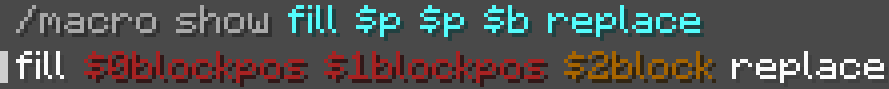
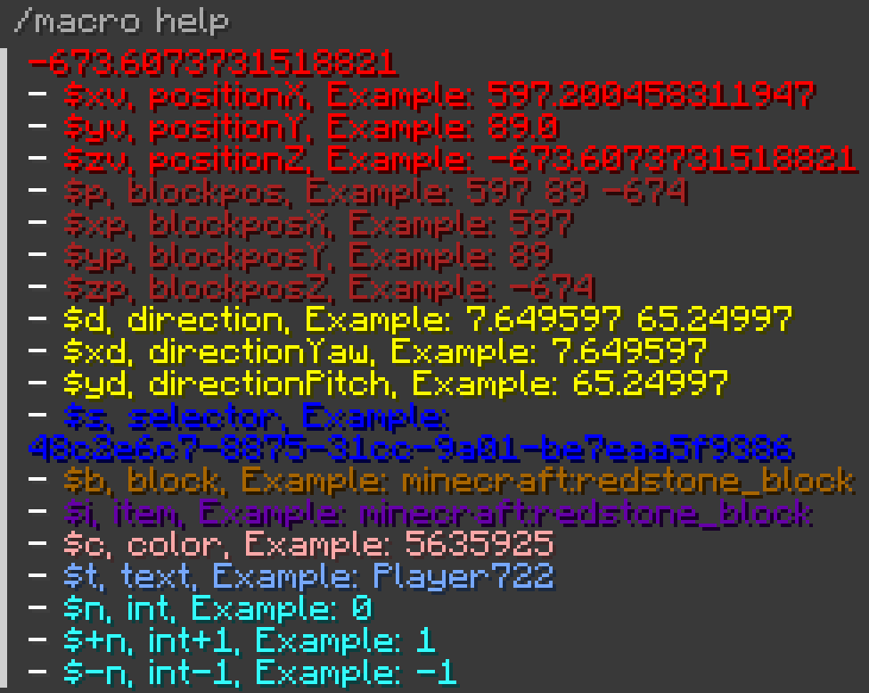
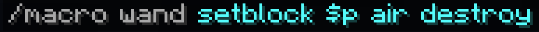

## Description
This mod add many helpful tools and addition for commands.

## Macros

Macros are commands you can put in every command holding blocks et items of this mod and that contains parameters of different types.

A command wand example.

## Command Wand

This command give to the caster a wand that fill its macro parameters on click. When all parameters are filled, the command is executed on caster.

Examples in the creative tabs.

## Command Machine

A sort of impulse command block with no UI, mineable with pickaxe and posable in survival.

Examples in the creative tabs.

## Get Color
Get the color under the caster mouse.

